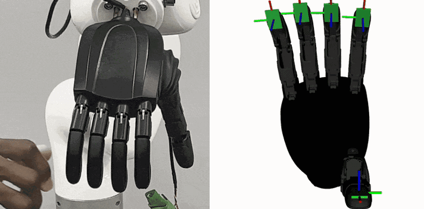
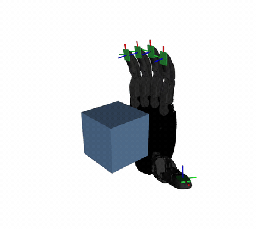
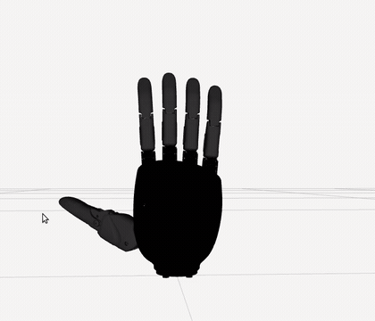

# realhand_l6_ros2

ROS 2 control driver, tactile contact controller, robot description, bringup, and MoveIt configuration for the RealHand L6 dexterous hand. The stack is implemented in C++ over Linux SocketCAN for ROS 2 Jazzy. CI exercises both a mock hardware stack and an emulated hand on a virtual CAN bus. The CAN protocol implementation and tactile contact controller have also been validated on a physical right L6.

[](https://github.com/coenwerem/realhand_l6_ros2/actions/workflows/ci.yml)


<p align="center">
  
</p>

Both clips above are from the same hardware test. The left clip shows fingertip contact detection from the driver's tactile state interfaces. The right clip renders the same contact state as pad markers in RViz, with yellow indicating contact.

<p align="center">
  
</p>

The mock-stack example above demonstrates contact-gated closing. The tactile pads cross the contact threshold sequentially from thumb to pinky. Each finger latches at its first detected contact and its marker turns red, making the latch order visible.

## Packages

Each package includes its own README with detailed interfaces, parameters, and launch options.

| Package | Content |
|---|---|
| `realhand_hardware` | Implements the `hardware_interface::SystemInterface` plugin `realhand_hardware/RealHandSystem`. Communicates with the RealHand CAN frame family over SocketCAN, exports position command and state interfaces for actuated joints, synthesizes state for coupled distal joints, exports one summed force state interface per tactile pad, and optionally exposes per-joint speed and torque command interfaces. Model-specific constants are selected through the `model` parameter. |
| `realhand_contact_controller` | Implements the `controller_interface::ControllerInterface` plugin `realhand_contact_controller/ContactGatedController`. Commands each finger toward a target and latches that finger when its tactile pad crosses a force threshold. Distinguishes contact-gated grip from closure in free space, supports ungated opening and monitor-only operation, uses real-time-safe publishing, and defines parameters through `generate_parameter_library`. |
| `realhand_l6_description` | Provides the L6 Xacro description for right and left hands, including meshes, `<finger>_pad` frames on each distal link, a tool center point, and a `ros2_control` macro that selects either `mock_components/GenericSystem` or the RealHand hardware plugin. |
| `realhand_l6_bringup` | Provides launch files for mock, virtual CAN, and physical hardware configurations, controller configuration, RViz contact markers, a `vcan0` hand emulator, a mock tactile-force ramp, and a read-only CAN probe. |
| `realhand_l6_moveit_config` | Provides an SRDF Xacro macro for arm-hand configurations, including finger chains, the `hand` group, `open`, `pinch`, and `power` states, and hand collision pairs. Also includes a standalone MoveIt demo for mock or physical hardware. |

## Quickstart With No Hardware

The mock stack requires only a ROS 2 Jazzy desktop installation.

```bash
mkdir -p ~/realhand_ws/src && cd ~/realhand_ws
git clone https://github.com/coenwerem/realhand_l6_ros2.git src/realhand_l6_ros2
rosdep install --from-paths src --ignore-src -y
colcon build --symlink-install
source install/setup.bash
ros2 launch realhand_l6_bringup mock.launch.py
```

RViz starts with the hand model and tactile pad markers. After a short delay, the mock stack issues a close request and drives the tactile pads above threshold one finger at a time, causing each finger to stop at a different joint angle. You can also publish requests directly while the stack is running.

```bash
ros2 topic pub --once /contact_gated_controller/open std_msgs/msg/Bool "{data: true}"
ros2 topic pub --once /contact_gated_controller/close_to sensor_msgs/msg/JointState \
  "{name: [thumb_cmc_pitch, thumb_cmc_yaw, index_mcp_pitch, middle_mcp_pitch, ring_mcp_pitch, pinky_mcp_pitch], position: [0.5, 1.2, 1.4, 1.4, 1.4, 1.4]}"
ros2 topic pub --once /tactile_mock_controller/commands std_msgs/msg/Float64MultiArray "{data: [0, 0, 9000, 0, 0]}"
ros2 topic echo /contact_gated_controller/contact_state
```

## Real Driver on a Virtual CAN Bus

The virtual CAN path runs `realhand_hardware` against an emulated hand, exercising the SocketCAN transport, CAN filters, frame decoding, and hardware activation sequence without physical hardware.

```bash
./src/realhand_l6_ros2/realhand_l6_bringup/scripts/setup_vcan.sh
ros2 launch realhand_l6_bringup vcan.launch.py
```

## Hardware

Bring `can0` up at 1 Mbit/s with the hand powered, then start with the read-only monitor. The monitor activates the hand by reading joint position, holding the current position, and enabling torque. It claims no command interfaces and publishes tactile contact and force states, allowing the finger mapping to be verified in RViz before commanding motion.

```bash
sudo ip link set can0 up type can bitrate 1000000
ros2 launch realhand_l6_bringup hardware.launch.py controller:=monitor
ros2 topic echo /tactile_monitor/finger_force
```

After verifying the tactile mapping, launch the full stack with the contact-gated controller.

```bash
ros2 launch realhand_l6_bringup hardware.launch.py side:=right can_interface:=can0
```

## Standard Controllers on the Position Interface

The driver exports a standard `position` command interface for each actuated joint, so it can be used with controllers other than the contact-gated controller. `controllers.yaml` in `realhand_l6_bringup` provides a `joint_trajectory_controller` for planners and scripted trajectories and a forward position controller for direct setpoints. Select either with `controller:=trajectory` or `controller:=position` in `hardware.launch.py`. Only one position controller may be active at a time; `ros2 control switch_controllers` can switch between them at runtime.

```bash
ros2 launch realhand_l6_bringup hardware.launch.py controller:=trajectory
ros2 action send_goal /hand_trajectory_controller/follow_joint_trajectory \
  control_msgs/action/FollowJointTrajectory \
  "{trajectory: {joint_names: [thumb_cmc_pitch, thumb_cmc_yaw, index_mcp_pitch, middle_mcp_pitch, ring_mcp_pitch, pinky_mcp_pitch], points: [{positions: [0.3, 0.8, 1.0, 1.0, 1.0, 1.0], time_from_start: {sec: 2}}]}}"
```

Each actuated joint also exports `speed` and `torque` command interfaces. These accept the raw 0-255 setpoints used by the hand, initialize from `activation_speed` and `activation_torque`, and transmit one CAN frame per command type when a value changes. Setting `setpoint_controllers:=true` starts forward controllers for both interfaces. This allows a client to reduce closing speed before contact or limit grip torque after latching while a position controller remains active.

```bash
ros2 topic pub --once /hand_speed_controller/commands std_msgs/msg/Float64MultiArray "{data: [40, 40, 40, 40, 40, 40]}"
ros2 topic pub --once /hand_torque_controller/commands std_msgs/msg/Float64MultiArray "{data: [120, 120, 120, 120, 120, 120]}"
```

For a ROS-independent tactile check, run `ros2 run realhand_l6_bringup can_tactile_probe --interface can0`. The probe sends only tactile-matrix read requests and prints per-finger sums and row rates. Run it with no other process using the CAN bus so the measured rate reflects the hand's response rate directly.

## MoveIt

`realhand_l6_moveit_config` provides the hand SRDF as the `realhand_l6_srdf` Xacro macro. It defines one serial-chain group per finger, the `hand` and `hand_actuated` groups, the `open`, `pinch`, and `power` states, and hand collision pairs. An arm-hand MoveIt configuration can include the file and instantiate the macro with its joint prefix and arm group. The standalone demo plans and executes trajectories for the `hand` group through `hand_trajectory_controller`.

```bash
ros2 launch realhand_l6_moveit_config demo.launch.py
ros2 launch realhand_l6_moveit_config demo.launch.py hardware:=real can_interface:=can0
```

<p align="center">
  
</p>

The clip above shows `move_group` on the mock stack planning and executing three joint-space goals in sequence: `power`, `pinch`, and `open`. The planned trajectory is displayed before each execution.

## Interfaces and Parameters

Each package README contains its detailed interface and parameter tables. [realhand_hardware](realhand_hardware/README.md) documents exported hardware interfaces and driver parameters. [realhand_contact_controller](realhand_contact_controller/README.md) documents topics, contact-state codes, and controller parameters. [realhand_l6_description](realhand_l6_description/README.md) documents Xacro arguments. [realhand_l6_bringup](realhand_l6_bringup/README.md) documents launch arguments, controllers, and entry points. [realhand_l6_moveit_config](realhand_l6_moveit_config/README.md) documents the SRDF macro and MoveIt configuration.

## Supported RealHand Models

Physical validation currently covers the right L6 over CAN. According to the vendor SDK, the L6, L7, O6, and L10 share the CAN frame family implemented by this driver: position `0x01`, torque `0x02`, speed `0x05`, and tactile matrices beginning at `0xb1`. Model-specific data, including joint names, radian scaling, mimic ratios, taxel geometry, matrix mode byte, and CAN IDs, is isolated in the model table. Supporting an L7, O6, or L10 therefore requires a model-table entry followed by hardware validation. Only validated entries are included in releases.

The L20, L21, L24, L25, and G20 use a different frame layout and require a separate codec. Contributions from users with access to those models are welcome.

The left L6 geometry mirrors the validated right-hand model and matches the vendor left URDF joint by joint. Its joint limits currently use the calibrated right-hand values so the URDF and driver table remain consistent. These limits have not yet been validated on a physical left L6.

## Tests

`colcon test` covers the CAN codec and model table with gtest, the controller state machine with owned loaned interfaces, and both hand descriptions with pytest over the generated Xacro. Controller-state tests cover contact latching, closure in free space, ungated opening, thumb-opposition ordering, and monitor-only operation.

The test suite also includes `launch_testing` coverage for the full mock stack with a `FollowJointTrajectory` goal, the real driver against an emulated hand on `vcan0` including speed-setpoint transmission, and `move_group` on mock hardware planning and executing the `pinch` state. The `vcan0` test is skipped when the interface is unavailable. CI runs the same suite on ROS 2 Jazzy for every push.

## Citing

The driver and controller were developed in support of the hardware experiments in the papers below. If this repository supports your work, cite the relevant paper.

```bibtex
@article{enwerem2026grasp,
  title={Grasp Execution Without a Planner: Configuration-Space Grasp Distance Fields with Certified Safety \& Guaranteed Quality},
  author={Enwerem, Clinton and Baras, John S. and Belta, Calin},
  journal={arXiv preprint arXiv:2608.00600},
  year={2026}
}

@article{enwerem2026firmgrasp,
  title={FIRMGrasp: A Friction-Informed Risk Margin for Robust Grasp Synthesis},
  author={Enwerem, Clinton and Baras, John S. and Belta, Calin},
  journal={arXiv preprint arXiv:2607.25049},
  year={2026}
}

@inproceedings{enwerem2026variational,
  title={Variational Neural Belief Parameterizations for Robust Dexterous Grasping under Multimodal Uncertainty},
  author={Enwerem, Clinton and Kalyanaraman, Shreya and Baras, John S. and Belta, Calin},
  booktitle={Proceedings of the IEEE/RSJ International Conference on Intelligent Robots and Systems (IROS)},
  year={2026},
  eprint={2604.25897},
  archivePrefix={arXiv},
  primaryClass={cs.RO},
  note={To appear}
}
```

## Attribution and License

This repository is licensed under Apache-2.0. The meshes are derived from the vendor's Apache-2.0 [linkerhand-urdf](https://github.com/linker-bot/linkerhand-urdf) release. The vendor SDK is available from [RealHand-Robotics](https://github.com/RealHand-Robotics). The `realhand_hardware` driver is independent of the vendor SDK and implements the CAN protocol directly.
