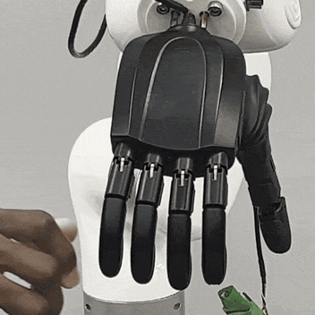
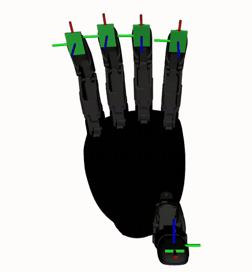

# realhand_l6_ros2

ros2_control driver, tactile contact controller, and robot description for the RealHand L6 dexterous hand. C++ over Linux SocketCAN, ROS 2 Jazzy, tested against a mock hardware stack and an emulated hand on a virtual CAN bus in CI, with the CAN protocol handling and the contact controller validated on a physical L6.

[](https://github.com/coenwerem/realhand_l6_ros2/actions/workflows/ci.yml)


<p align="center">
  
  
</p>

Specifically, the pair above comes from one hardware session, fingertip contact detection on the real hand through the driver tactile export on the left, and the same signal drawn as pad markers in RViz on the right, yellow on contact.

<p align="center">
  
</p>

By contrast, the third clip shows the contact gated close on the mock stack, each finger stops where its pad first reports contact and turns red, with the pads pressed in sequence, thumb to pinky, so the latch order shows.

## Packages

Each package has its own README with the full tables.

| Package | Content |
|---|---|
| `realhand_hardware` | `hardware_interface::SystemInterface` plugin `realhand_hardware/RealHandSystem`. Speaks the RealHand CAN frame family over SocketCAN, position command and state for the actuated joints, synthesized state for the coupled distal joints, one summed force state interface per tactile pad, and optional per joint speed and torque command interfaces. Per model constants live in a table selected by a `model` parameter. |
| `realhand_contact_controller` | `controller_interface::ControllerInterface` plugin `realhand_contact_controller/ContactGatedController`. Closes each finger toward a target and freezes the finger the moment its pad crosses a force threshold, reports gripped versus closed on air, ungated open, monitor only mode. Real time safe publishing, parameters through `generate_parameter_library`. |
| `realhand_l6_description` | Xacro macro for the L6, right and left, meshes, `<finger>_pad` frames on each distal link, tool center point, and a `ros2_control` macro switching between `mock_components/GenericSystem` and the real driver. |
| `realhand_l6_bringup` | Launch files for mock, virtual CAN, and hardware, controller configuration, RViz contact markers, an emulated hand for `vcan0`, a pad force ramp for the mock, and a read only CAN probe. |

## Quickstart with no hardware

The mock stack needs nothing beyond a Jazzy desktop install.

```bash
mkdir -p ~/realhand_ws/src && cd ~/realhand_ws
git clone https://github.com/coenwerem/realhand_l6_ros2.git src/realhand_l6_ros2
rosdep install --from-paths src --ignore-src -y
colcon build --symlink-install
source install/setup.bash
ros2 launch realhand_l6_bringup mock.launch.py
```

Then RViz opens with the hand and the pad markers. After a few seconds a close request goes out and the mock ramp presses the pads one finger at a time, so every finger stops at a different angle. Send your own requests while the mock stack runs.

```bash
ros2 topic pub --once /contact_gated_controller/open std_msgs/msg/Bool "{data: true}"
ros2 topic pub --once /contact_gated_controller/close_to sensor_msgs/msg/JointState \
  "{name: [thumb_cmc_pitch, thumb_cmc_yaw, index_mcp_pitch, middle_mcp_pitch, ring_mcp_pitch, pinky_mcp_pitch], position: [0.5, 1.2, 1.4, 1.4, 1.4, 1.4]}"
ros2 topic pub --once /tactile_mock_controller/commands std_msgs/msg/Float64MultiArray "{data: [0, 0, 9000, 0, 0]}"
ros2 topic echo /contact_gated_controller/contact_state
```

## The real driver on a virtual CAN bus

The virtual bus path runs `realhand_hardware` itself, socket, filters, frame decode, and activation sequence, against an emulated hand.

```bash
./src/realhand_l6_ros2/realhand_l6_bringup/scripts/setup_vcan.sh
ros2 launch realhand_l6_bringup vcan.launch.py
```

## Hardware

Bring `can0` up at 1 Mbit/s with the hand powered, then run the read only monitor first. The monitor activates the hand (reads position, holds position, enables torque), claims no command interfaces, and publishes contact and force so you can press each pad and confirm the finger mapping in RViz before anything moves.

```bash
sudo ip link set can0 up type can bitrate 1000000
ros2 launch realhand_l6_bringup hardware.launch.py controller:=monitor
ros2 topic echo /tactile_monitor/finger_force
```

Next, the full stack replaces the monitor with the contact gated controller.

```bash
ros2 launch realhand_l6_bringup hardware.launch.py side:=right can_interface:=can0
```

## Standard controllers on the position interface

The driver exports a plain `position` command interface per actuated joint, so any position controller works, not only the contact gated one. `controllers.yaml` in `realhand_l6_bringup` ships a `joint_trajectory_controller` for planners and scripts and a forward position controller for direct setpoints, and `hardware.launch.py` picks one with `controller:=trajectory` or `controller:=position`. Only one position controller can be active at a time, and `ros2 control switch_controllers` swaps them at runtime.

```bash
ros2 launch realhand_l6_bringup hardware.launch.py controller:=trajectory
ros2 action send_goal /hand_trajectory_controller/follow_joint_trajectory \
  control_msgs/action/FollowJointTrajectory \
  "{trajectory: {joint_names: [thumb_cmc_pitch, thumb_cmc_yaw, index_mcp_pitch, middle_mcp_pitch, ring_mcp_pitch, pinky_mcp_pitch], points: [{positions: [0.3, 0.8, 1.0, 1.0, 1.0, 1.0], time_from_start: {sec: 2}}]}}"
```

Beyond position, every actuated joint also exports `speed` and `torque` command interfaces, raw 0 to 255 setpoints the hand applies per joint, seeded from `activation_speed` and `activation_torque` and sent as one frame per type on change. `setpoint_controllers:=true` spawns forward controllers on both, so a script can slow the close before contact or cap grip torque after latch while any position controller runs.

```bash
ros2 topic pub --once /hand_speed_controller/commands std_msgs/msg/Float64MultiArray "{data: [40, 40, 40, 40, 40, 40]}"
ros2 topic pub --once /hand_torque_controller/commands std_msgs/msg/Float64MultiArray "{data: [120, 120, 120, 120, 120, 120]}"
```

In addition, for a check independent of ROS, `ros2 run realhand_l6_bringup can_tactile_probe --interface can0` sends only matrix read requests and prints per finger sums and row rates. Run the probe with nothing else on the bus so the rate you read is the hand's own.

## Interfaces and parameters

Each package README holds its own tables. [realhand_hardware](realhand_hardware/README.md) lists the exported interfaces and every driver parameter, [realhand_contact_controller](realhand_contact_controller/README.md) the topics, contact codes, and controller parameters, [realhand_l6_description](realhand_l6_description/README.md) the macro arguments, and [realhand_l6_bringup](realhand_l6_bringup/README.md) the launch arguments, controllers, and entry points.

## Which RealHand models

Validated on a right L6 over CAN. The frame family the driver speaks, position 0x01, torque 0x02, speed 0x05, tactile matrices 0xb1 and up, is shared by the L6, L7, O6, and L10 per the vendor SDK, and everything model specific in the driver is a table entry, joint names and radian scaling, mimic ratios, taxel geometry, matrix mode byte, CAN ids. Adding an L7, O6, or L10 is a table entry plus a check on real hardware, and only validated entries ship. The L20, L21, L24, L25, and G20 use a different frame layout and need a second codec. Contributions with hardware access are welcome.

In particular, the left L6 geometry is the mirror of the validated right hand and matches the vendor left URDF joint by joint. Its joint limits are set to the right hand's calibrated values so the driver table and the URDF agree, and are unvalidated on a left unit.

## Tests

`colcon test` runs gtest on the CAN codec and model table, gtest on the controller state machine with loaned interfaces the test owns (latch on contact, closed on air, ungated open, thumb opposition ordering, monitor only), a pytest over the xacro for both sides and both hardware plugins, a `launch_testing` run of the whole mock stack including a `FollowJointTrajectory` goal through the trajectory controller, and a `launch_testing` run of the real driver on `vcan0` that also checks speed setpoints reach the bus, skipped when the interface is absent. CI runs the same suite on Jazzy for every push.

## Citing

The driver and controller grew out of the hardware experiments in the papers below. If the code helps your work, cite one of them.

```bibtex
@article{enwerem2026grasp,
  title={Grasp Execution Without a Planner: Configuration-Space Grasp Distance Fields with Certified Safety \& Guaranteed Quality},
  author={Enwerem, Clinton and Baras, John S. and Belta, Calin},
  journal={arXiv preprint arXiv:2608.00600},
  year={2026}
}

@article{enwerem2026firmgrasp,
  title={FIRMGrasp: A Friction-Informed Risk Margin for Robust Grasp Synthesis},
  author={Enwerem, Clinton and Baras, John S. and Belta, Calin},
  journal={arXiv preprint arXiv:2607.25049},
  year={2026}
}

@inproceedings{enwerem2026variational,
  title={Variational Neural Belief Parameterizations for Robust Dexterous Grasping under Multimodal Uncertainty},
  author={Enwerem, Clinton and Kalyanaraman, Shreya and Baras, John S. and Belta, Calin},
  booktitle={Proceedings of the IEEE/RSJ International Conference on Intelligent Robots and Systems (IROS)},
  year={2026},
  eprint={2604.25897},
  archivePrefix={arXiv},
  primaryClass={cs.RO},
  note={To appear}
}
```

## Attribution and license

Apache-2.0. Meshes derive from the vendor's Apache-2.0 [linkerhand-urdf](https://github.com/linker-bot/linkerhand-urdf) release. The vendor's own SDK lives at [RealHand-Robotics](https://github.com/RealHand-Robotics). The driver in `realhand_hardware` is independent of the vendor SDK and speaks the CAN protocol directly.
